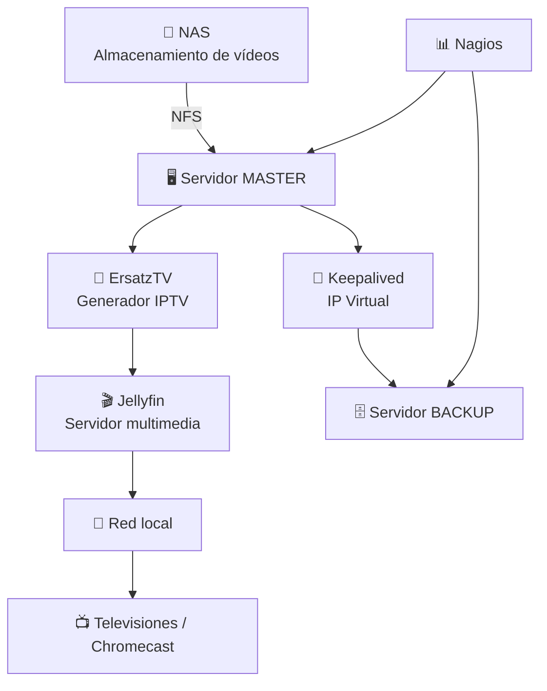

> [!NOTE]
> Apartado de keepalived actualizado en el Google Docs (el antiguo está en el fichero_proyecto)

# Proyecto-IPTVilladeAgüimes

# 📺 Streaming IPTVilladeAgüimes

### Sistema de Streaming IPTV interno para distribución de contenido informativo

Infraestructura de streaming diseñada para **automatizar la reproducción de vídeos informativos en las televisiones del centro**, eliminando la necesidad de utilizar dispositivos USB y mejorando la gestión del contenido multimedia.

---

## 🧠 Arquitectura del sistema

---

## ✨ Vista rápida

- Emisión continua 24/7  
- Bucle automático del vídeo 1 al 10 y vuelta a empezar  
- Sin pendrives, sin desplazamientos y sin coste de licencias  
- Stack basado en software libre 

# ⚙️ Stack tecnológico del proyecto

<table>
<tr>
<td align="center" width="160">

**Sistema Operativo**

🐧  
Ubuntu Server

</td>

<td align="center" width="160">

**Servidor Multimedia**

🎬  
Jellyfin

</td>

<td align="center" width="160">

**Generador IPTV**

📡  
ErsatzTV

</td>

<td align="center" width="160">

**Alta Disponibilidad**

🔁  
Keepalived

</td>

<td align="center" width="160">

**Monitorización**

📊  
Nagios

</td>

<td align="center" width="160">

**Almacenamiento**

💾  
NAS

</td>

</tr>
</table>

---

# 📖 Descripción del proyecto

Actualmente, la actualización de los vídeos informativos del centro requiere un proceso manual que implica desplazarse físicamente hasta las televisiones situadas en los extremos del centro para copiar los vídeos mediante un **pendrive** y reiniciar la reproducción manualmente.

Este procedimiento presenta varios inconvenientes:

* ⏳ Pérdida de tiempo al desplazarse
* 🔌 Dependencia de dispositivos USB
* ⚙️ Falta de automatización del proceso
* 📂 Gestión poco eficiente del contenido multimedia

El proyecto **Streaming IPTVilladeAgüimes** propone una solución basada en **streaming IPTV interno**, permitiendo gestionar los vídeos desde un servidor centralizado y reproducirlos automáticamente en las televisiones del centro.

Además, el sistema está pensado como una emisión continua de tipo canal de televisión, con reproducción en bucle, accesible dentro de la red local y preparada para funcionar sin intervención constante. 

---

# 🎯 Objetivos

## Objetivo principal

Implementar un sistema de **streaming interno centralizado** que permita distribuir vídeos informativos de forma rápida, sencilla y eficiente dentro de la red del centro.

## Objetivos específicos

* Eliminar el uso de **pendrives** para actualizar contenido
* Centralizar la **gestión de vídeos**
* Permitir una **actualización rápida del contenido**
* Garantizar **alta disponibilidad del servicio**
* Implementar **monitorización del sistema** para detectar fallos

---

# 🏗 Arquitectura del sistema

El sistema está compuesto por **tres máquinas virtuales con Ubuntu Server**, cada una con una función específica dentro de la infraestructura.

| Máquina           | Función                         | Servicios          |
| ----------------- | ------------------------------- | ------------------ |
| 🖥 MASTER         | Servidor principal de streaming | Jellyfin, ErsatzTV |
| 🗄 BACKUP         | Servidor de alta disponibilidad | Keepalived         |
| 📊 MONITORIZACIÓN | Supervisión del sistema         | Nagios             |

Esta arquitectura permite disponer de **un sistema estable, monitorizado y con alta disponibilidad** dentro de la red del centro.

---

# 🖥 Infraestructura

## Servidor MASTER

El servidor **MASTER** es el encargado de ejecutar los servicios principales del sistema de streaming.

### Servicios instalados

**Jellyfin**

Servidor multimedia encargado de gestionar la biblioteca de vídeos y organizar el contenido multimedia.

**ErsatzTV**

Herramienta que permite generar **canales IPTV virtuales** a partir de los contenidos multimedia disponibles.

Este servidor distribuye los vídeos mediante **streaming dentro de la red local** hacia las televisiones del centro.

El proyecto usa el flujo **NAS → NFS → ErsatzTV → lista M3U / TS → Jellyfin → Chromecast**, que convierte los vídeos almacenados en un canal continuo de TV. 

---

## 🗄 Servidor BACKUP

El servidor **BACKUP** se encarga de garantizar la continuidad del servicio en caso de fallo del servidor principal.

### Servicio instalado

**Keepalived**

Permite implementar un sistema de **failover automático**, de forma que si el servidor MASTER deja de funcionar, el servidor BACKUP puede asumir automáticamente el servicio.

Esto proporciona **alta disponibilidad del sistema de streaming**.

---

# 📊 Servidor de monitorización

El servidor de **MONITORIZACIÓN** supervisa el estado de los servidores del sistema.

### Servicio instalado

**Nagios**

Funciones principales:

* Monitorizar el estado de los servidores
* Detectar si una máquina está **UP o DOWN**
* Identificar rápidamente fallos en la infraestructura

Esto permite mantener el sistema bajo supervisión constante y reaccionar rápidamente ante posibles incidencias.

---

# 💾 Almacenamiento de contenidos

Los vídeos utilizados para el sistema de streaming **se almacenan en un NAS (Network Attached Storage)** conectado a la red del centro.

El uso de un NAS permite:

* 📂 Centralizar el almacenamiento de contenidos
* 📈 Aumentar la capacidad de almacenamiento
* 🔄 Facilitar la actualización de vídeos
* ⚙️ Separar almacenamiento y procesamiento del streaming

Los servidores acceden al NAS para obtener los archivos multimedia que posteriormente se distribuyen mediante streaming.

El montaje se realiza por **NFS**, y el servidor trata la carpeta compartida como si fuera un directorio local. En la web del proyecto aparece como una pieza clave del flujo de reproducción. 

---

# 🌐 Red del sistema

El proyecto trabaja en la red **172.29.172.0/24**. Las máquinas principales usan estas direcciones:

- NAS: `172.29.172.250`
- Servidor principal: `172.29.172.115`
- Servidor backup: `172.29.172.114`
- Nagios: `172.29.172.110`
- IP virtual de Keepalived: `172.29.172.200`

### Puertos importantes

- `8096` → Jellyfin
- `8409` → ErsatzTV
- `8080` → Nagios
- `8000` → NAS
- `2049` → NFS 

---

# 🧰 Tecnologías utilizadas

| Tecnología         | Función                             |
| ------------------ | ----------------------------------- |
| Ubuntu Server      | Sistema operativo de los servidores |
| Jellyfin           | Gestión de contenido multimedia     |
| ErsatzTV           | Generación de canales IPTV          |
| Keepalived         | Alta disponibilidad                 |
| Nagios             | Monitorización                      |
| NAS                | Almacenamiento centralizado         |
| Máquinas virtuales | Infraestructura del proyecto        |

---

# 🔁 Flujo de funcionamiento

## 1. El NAS almacena los vídeos
Los archivos MP4 se guardan en el NAS y se organizan de forma secuencial. 

## 2. ErsatzTV genera la emisión
ErsatzTV lee los vídeos y crea un stream continuo en formato MPEG-TS, con reproducción en bucle. 

## 3. Se expone la lista M3U
El sistema publica una lista M3U para que clientes compatibles puedan consumir el canal. 

## 4. Jellyfin consume el stream
Jellyfin toma el stream como sintonizador M3U y lo presenta como un canal continuo.

## 5. La TV reproduce el contenido
El cliente final recibe el canal en la red local y reproduce la emisión sin intervención manual. 

---

# 🚀 Resultados esperados

Con la implementación de este sistema se espera:

* Simplificar la gestión de los vídeos informativos
* Reducir el tiempo necesario para actualizar contenidos
* Eliminar la dependencia de dispositivos USB
* Mejorar la eficiencia del proceso de distribución de vídeos
* Disponer de una infraestructura **más moderna, automatizada y profesional**

---

# ✅ Resultados y validación

El sistema fue probado exhaustivamente y el proyecto refleja un resultado de **7 pruebas realizadas y 7/7 correctas**, con un desarrollo efectivo de alrededor de **48 horas**.

### Puntos fuertes del despliegue

* Emisión continua 24/7
* Bucle infinito sin intervención
* Alta disponibilidad con Keepalived
* Monitorización centralizada con Nagios
* Stack basado íntegramente en software libre 

---

# 🧪 Pruebas realizadas

| ID | Prueba | Estado |
| --- | --- | --- |
| PF01 | Despliegue de la infraestructura base | Correcto |
| PF02 | Montaje NFS y acceso al NAS | Correcto |
| PF03 | Emisión de ErsatzTV | Correcto |
| PF04 | Integración con Jellyfin | Correcto |
| PF05 | Monitorización con Nagios | Correcto |
| PF06 | Validación de carga / transcodificación | Correcto |
| PF07 | Alta disponibilidad con Keepalived | Correcto |

---

# 📊 Métricas del proyecto

| Métrica | Valor |
| --- | --- |
| Emisión | 24/7 |
| Bucle | Continuo |
| Coste de licencias | 0€ |
| Software libre | 100% |
| Pruebas | 7 |
| Resultado | 7/7 |
| Tiempo efectivo | 48h | 

---

# 🧱 Alta disponibilidad

El sistema está diseñado para funcionar con **failover automático** gracias a **Keepalived**. Si el servidor principal cae, el backup puede asumir la IP virtual y continuar con el servicio.

Esto reduce el impacto de fallos y mantiene la emisión activa con una interrupción mínima.

---

# 📡 Monitorización

**Nagios Core** supervisa el estado del sistema y permite detectar rápidamente incidencias en:

- Jellyfin
- ErsatzTV
- IP virtual
- conectividad general del stack

---

# 🧠 Cómo funciona

El sistema sigue esta lógica:

1. Los vídeos se guardan en el NAS.
2. El servidor principal los monta por NFS.
3. ErsatzTV crea la emisión IPTV.
4. Jellyfin consume el canal.
5. La televisión reproduce el contenido en bucle. 

---

# 🔧 Mantenimiento y expansión

Para ampliar el proyecto solo hay que:

- añadir más vídeos al NAS
- hacer un nuevo escaneo de biblioteca en ErsatzTV
- mantener el sistema monitorizado
- dejar que el bucle continúe automáticamente

---

# 👨‍💻 Autores

Proyecto académico desarrollado por:

**Samuel Cruz López y**
**Simone Monzani Estevez**
- Alumnos del CIFP Villa de Agüimes, 2º del CFGS ASIR

---

# 📘 Información adicional

- Proyecto desarrollado en el curso 2025–2026.
- Presentación prevista para el 17 de abril de 2026.
- Basado en Docker, NFS, IPTV, Jellyfin, ErsatzTV, Keepalived y Nagios. 
